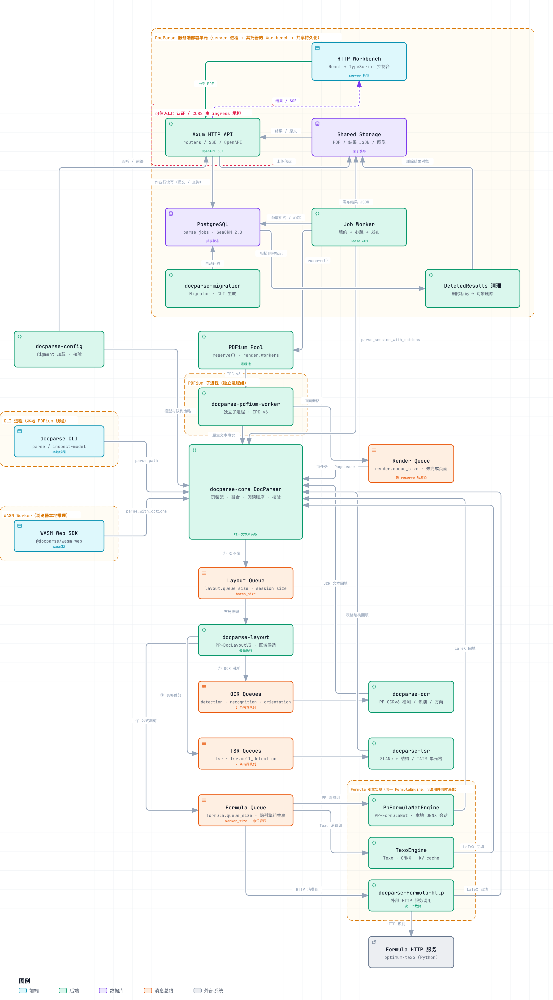

# DocParse

DocParse is a Rust PDF parsing pipeline. PDFium supplies native text facts and page rendering, the pinned PP-DocLayoutV3 ONNX model detects layout regions, SLANet_plus predicts table structures, PaddleOCR recovers scanned text, and `docparse-core` fuses both into a stable, validated `DocumentResult`. Residual XY-cut preserves text when the model misses regions or page-level layout inference fails.

The native [HTTP server](crates/server/README.md) accepts durable PDF jobs and
provides JSON results and reconnectable SSE progress. It uses SeaORM 2.0,
PostgreSQL, and a shared file directory, with separate migration, database, and
server crates. Idle PDFium processes claim new documents; a shared render queue
bounds unfinished pages while models consume their own bounded input queues.

Model regions are candidates rather than a one-to-one final block contract. Ownership is assigned at the `TextItem` boundary, with short, unambiguous superscripts/subscripts attached to their parent before model assignment; residual XY-cut preserves column gutters before line assembly. Page-wide normalization merges content only when one bbox fully contains the other, including identical boxes, then computes reading order. Every native text fact remains owned exactly once.

`reference` is an empty visual annotation: it never owns text, obstructs XY-cut, merges with content, or enters body reading order. Bibliography text uses `reference_content`, including recovered fragments. Partial content intersections remain separate regardless of IoU and produce a `ContentLayoutOverlap` page warning with per-pair `content.overlap.*` diagnostics. Reference outlines and detached watermarks are exempt. Merged layouts retain their primary `source_region` plus all contributing `source_regions`, whose optional `label` preserves original model semantics.

## Architecture



Three entry points (the HTTP workbench that `docparse-server` serves, the native CLI, and the browser WASM SDK), the durable job path over PostgreSQL `parse_jobs` and the shared file directory, and the per-page pipeline with its required work queues: render admission first, then the layout, OCR, table and formula stages, each submitting into its own bounded model queue and returning its result to `docparse-core` for fusion. Queue capacities, session counts and batch limits are configuration, not code constants.

Diagram labels are Simplified Chinese. The [vector source](docs/architecture/docparse-architecture.svg) is exported from the same figure, and the [Archify source](docs/architecture/docparse-architecture.archify.json) regenerates it as an interactive HTML with zoom, light/dark theme and PNG/SVG export:

```sh
node <archify>/bin/archify.mjs finalize architecture \
  docs/architecture/docparse-architecture.archify.json \
  .archify/docparse-architecture.html --repo-root . --quality showcase
```

## Prepare the model

Models are distributed separately from the repository and crates. Download and verify the pinned revision using the dependency-locked uv script:

```bash
rtk uv run --locked scripts/download_models.py
rtk uv run --locked scripts/download_models.py --verify-only
rtk python3 crates/formula-texo/examples/download.py models/texo
```

The source is `PaddlePaddle/PP-DocLayoutV3_onnx` revision `46bbdf188bb0a772c08aed74882ce7e51a8f1ea6`. Validation covers ONNX/YAML SHA-256 values, model schema, and the preprocessing contract.

The default command provisions layout, table models, OCR, Texo and PP-FormulaNet_plus-S/Plus-M/Plus-L
with their matching tokenizer in the repository's `models/` directory. Verified local
files are skipped; missing or corrupt files are downloaded and verified before
publication. Use `--model slanet-plus` for one model, `--models-dir /path/to/models`
for another root, or `--model pp-doclayout-v3 --output /path/to/layout` for an exact
single-model directory. All Python tools use the root `pyproject.toml`, `.python-version`
and `uv.lock`; see [scripts/README.md](scripts/README.md) for retained tools and dependency groups.

## Configuration

The root `docparse.toml` is an example configuration. Native inference backends are selected by Cargo features, with CPU as the default. Relative model paths resolve against the primary configuration directory. Precedence is: code defaults, primary TOML, explicit/`DOCPARSE_PROFILE` profile file, `DOCPARSE_...` environment variables, then explicit caller overrides.

Without `--config`, the CLI reads only `./docparse.toml` in the current directory and does not search parents. Library APIs do not load configuration files implicitly.

The default model combination is SLANet+ with wireless RT-DETR cell detection.
The root configuration uses `tsr.mode = "tsr_only"` to send every table to TSR.
Library defaults retain `"fallback"`: local rules run first and unresolved tables
use that same model combination. Select `"tsr_only"` for every table,
or `"rules_only"` to retain local behavior without loading TSR artifacts. Layout,
OCR and TSR share the compiled native backend. Structured
output keeps the existing `external_tsr` source value and records the engine in
evidence; a model prediction is accepted only after topology and source validation.
`table.source` distinguishes local `tagged_pdf`, `ruled`, and `text_alignment`
reconstruction from `external_tsr` model/caller input. The Web inspector displays
this as Rules or TSR input.

For a pure SLANet+ comparison, replace the TSR sections in `docparse.toml` with the
[SLANet+ example](crates/tsr/README.md): the shipped configuration selects TATR with
wireless RT-DETR cells, and disabling only `tsr.cell_detection` would leave TATR without
cell detection. To compare SLANeXt wireless plus cell detection, replace the TSR
settings with the same [inline configuration examples](crates/tsr/README.md).

## Build and CUDA

CPU:

```bash
rtk cargo build -p docparse-cli
```

NVIDIA CUDA:

```bash
rtk cargo build -p docparse-cli --features cuda
rtk docparse parse input.pdf --config docparse.toml --format json
```

Native layout, OCR, TSR and formula share a backend selected by Cargo features; TOML and environment `execution_provider` overrides are rejected. Core, CLI and server expose only unified `cuda`, `tensorrt`, `coreml`, `metal`, and `openvino` provider features. Each core feature enables the same provider for all four model crates (`tensorrt` applies TensorRT only to the models listed below and CUDA to the rest); CLI and server forward it unchanged. Model-prefixed provider features are not supported. Omit accelerator features for CPU. Metal uses CoreML with CPU/GPU compute units, without ANE. An enabled accelerator that cannot initialize fails explicitly. CUDA, CoreML/Metal, and OpenVINO features are mutually exclusive; do not use `--all-features`. Large models can retain several GiB per CUDA session, so size `session_size` for the device.

`--features tensorrt` (core, CLI and server; it implies `cuda`) runs layout, OCR, TATR, the table-cell detectors and the Texo encoder through TensorRT with CUDA as the fallback. Graphs TensorRT rejects stay on CUDA: the merged Texo decoder (`If` control flow), PP-FormulaNet, and the SLANet+/SLANeXt structure models (autoregressive `Loop` decoders). Each TensorRT model declares a fixed shape profile covering batch 1 through its configured `batch_size`, so one engine serves every request. These builds require `[runtime] tensorrt_cache_dir`; the first start builds all engines (several minutes; the OCR detector alone takes about two and a half when OCR is enabled) and later starts reuse them. Engine files are named by the pinned model hash, batch size and dynamic extent, so changing a model or its limits builds a new engine instead of reusing a stale one; delete the directory to reclaim space from old engines, and clear it after upgrading TensorRT or ONNX Runtime or moving to a different GPU model, because engines are specific to all three. TensorRT 10 runtime libraries (`libnvinfer.so.10`, `libnvonnxparser.so.10`) must be on the library path at runtime; ONNX Runtime 1.29 does not load TensorRT 11.

CoreML and Metal sessions request `FastPrediction` specialization for their reusable models. The [M4 benchmark report](docs/reports/2026-09-15-coreml-performance/README.md) records warmed real-PDF measurements and the compatibility and output checks for alternative settings.

### Render backpressure

`render.workers` is the PDFium process-pool size. Server workers reserve a shared
document slot before claiming a PDF and retain it through parsing, result publication,
durable completion, and actual background cleanup. The document budget is
`render.workers + render.queue_size`, allowing rendering and inference to overlap
while bounding results waiting for publication. Uploads still persist and queue
independently of this budget. `render.queue_size` is required and counts unfinished
pages across all documents sharing a parser, including rendering, model work and cleanup.

Capacity is reserved before rendering and returned only after result collection
and the last actual resource owner releases it. Receiving a raster does not free
its slot. `server.jobs`, `server.pdfium_workers`, `runtime.stage_pages`,
`runtime.render_queue_capacity` and `runtime.blocking_task_limit` are rejected.
Use `--render-workers` for a server override. WASM requires `render.workers = 1`
and accepts `render.queue_size > 1` without removing ORT Web's global guard.

`runtime.optimization_level` sets graph optimization for every ONNX session,
including CPU compatibility and model inspection. It accepts `level1` (default),
`level2`, `level3`, and `all`; native configuration overrides can use
`DOCPARSE_RUNTIME__OPTIMIZATION_LEVEL`. Each parser retains its own setting.
`runtime.memory_pattern` is one boolean for every session, defaulting to `false`
for variable batches and decoder caches. `true` enables it globally on native
and WASM CPU; ORT Web independently forces it off for WebGPU. Environment
overrides can use `DOCPARSE_RUNTIME__MEMORY_PATTERN`.

`runtime.continue_on_error` controls continuation after recoverable page failures
(default `true`). The CLI override is `--continue-on-error true|false`; the former
`continue_on_page_error` key is rejected. Fatal document/transport errors still stop parsing.

### Model queues and inference limits

`crates/common` owns queues, native thread/session lifetime, cancelable task groups,
portable runtime helpers, and timing contexts. Model crates retain loading, tensor
batching, inference, and output conversion.

Local models have independent ONNX owners configured by `session_size` (positive integer, default 1),
consuming one shared bounded queue. Required `queue_size` independently bounds
pending inputs; a full queue waits for space. It may be smaller than `batch_size`.
`batch_size` (1–32) caps the number of ready
inputs taken by an idle consumer: it runs a short batch immediately and never
waits to fill it. Additional sessions duplicate model/runtime resources.

| Model | Session count | Batch limit | Required queue capacity |
| --- | --- | --- | --- |
| Layout | `layout.session_size` | `layout.batch_size` | `layout.queue_size` |
| PP / Texo formula | `formula.engine[].worker_size` | `formula.engine[].batch_size` | `formula.queue_size` |
| Table structure | `tsr.session_size` | `tsr.batch_size` | `tsr.queue_size` |
| Table cells | `tsr.cell_detection.session_size` | `tsr.cell_detection.batch_size` | `tsr.cell_detection.queue_size` |
| OCR detection | `ocr.detection.session_size` | `ocr.detection.batch_size` | `ocr.detection.queue_size` |
| OCR recognition | `ocr.recognition.session_size` | `ocr.recognition.batch_size` | `ocr.recognition.queue_size` |
| OCR orientation | `ocr.orientation.session_size` | `ocr.orientation.batch_size` | `ocr.orientation.queue_size` |

OCR drains individual requests across pages, then merges equal tensor shapes to
preserve existing padding and output semantics. Detection defaults to batch 1;
recognition and orientation default to 16. Layout and table model batches default
to 1. OCR has no separate page concurrency gate; each model uses its session
count and queue backpressure. Expensive preprocessing is admitted before allocation:
layout and OCR detection use `session_size * batch_size + queue_size`; OCR line
crops share the maximum capacity of recognition and enabled orientation. Table
crops share the maximum capacity of structure and enabled cell detection, with a
bounded per-page future window. Custom table providers expose a `ResourceBudget`
whose fixed capacity controls that window and whose permits govern allocation;
otherwise all parser clones share the configured table budget. TSR reserves a
separate tensor slot on every prediction, including repeated use of one crop.
The retired `table_jobs` setting remains unsupported.
Replace old `sessions` keys with `session_size`, and replace `ocr.batch_size` with
the three model-specific settings above. HTTP formula recognition remains an external service
configured with `formula.engine[].worker_size` and the same required `formula.queue_size`.
All seven model queue capacities, plus render.workers and render.queue_size, must be supplied by configuration files or overrides;
missing values and zero are rejected, including for disabled model sections.
Rust callers can explicitly choose `RawConfig::default()` as a complete preset.
Queue capacity counts pending inputs, separately from active batches. Preparation
budgets cover allocated inputs, including blocked senders and canceled work still
owned by a CPU worker or model. Native producers reserve FIFO capacity without
broadcast wakeups; partial ready batches still run immediately. Whole-document
results remain proportional to document size; the server budget bounds their
concurrency, not an arbitrary PDF's total byte size.

Native engines survive their construction Tokio runtime. Browser consumers share
the same queues but retain the global ORT inference/readback guard, so extra
browser sessions do not bypass runtime serialization.

### Formula recognition

`[formula] inline_enabled = true` and `display_enabled = true` independently enable inline and display formula recognition. Both default to true and use Texo. Install its pinned encoder, decoder, and tokenizer with `rtk python3 crates/formula-texo/examples/download.py models/texo`. Set both toggles to false to skip formula model loading; the former `formula.enabled` key is no longer accepted. `batch_size` defaults to 4 and `timeout_ms` to 120000 per crop, including admission and queueing. Formula numbers remain native text. Disabling either kind preserves its native text and layout while skipping recognition and recognized-LaTeX projection. The browser SDK and example support Texo/PP selection with preset resources; see `packages/wasm-web/README.md`.

Every formula engine shares a bounded queue across its callers. Idle model owners
consume already-ready crops up to the configured batch limit without waiting for
more arrivals. Parser submission is a sliding window with a shared pre-crop
admission budget, so one slow formula does not block subsequent crops from the
same page or cause unrelated formulas to fail. Table requests are submitted concurrently; structure and cell detectors retain
their separate ready-only queues.

To evaluate Plus-M, provision `--model pp-formulanet-plus-m` and update the existing
`[[formula.engine]]` selection in `docparse.toml`:

```toml
[formula]
inline_enabled = true
display_enabled = true

[[formula.engine]]
type = "pp"
model_path = "models/pp-formulanet-plus-m/inference.onnx"
tokenizer_path = "models/pp-formulanet-plus-m/tokenizer.json"
model_manifest_path = "models/pp-formulanet-plus-m/model-manifest.json"
```

To select Texo explicitly, keep the shared `[formula]` policy and replace its consumer list:

```toml
[[formula.engine]]
type = "texo"
encoder_path = "models/texo/encoder_model.onnx"
decoder_path = "models/texo/decoder_model_merged.onnx"
tokenizer_path = "models/texo/tokenizer.json"
```

Paths are variant-specific; the former flat `formula.model_path`, `tokenizer_path`,
and `model_manifest_path` keys are rejected. Engine selection does not depend on
filenames. Profile/environment switches replace the previous variant's paths.
See `crates/formula-texo/README.md` for downloads and backend validation.

Native CLI/server and WASM builds can instead call an external HTTP formula service
without local formula weights. For an image-only service such as Texo Optimum:

The [included Optimum CUDA server](optimum-texo/README.md) provides this API and is managed with `uv`.

```toml
[[formula.engine]]
type = "http"
server_url = "http://127.0.0.1:6008"
worker_size = 32
```

With no `prompt`, the adapter uploads a PNG to `/v1/predictions/upload` and reads
`{"text":"..."}`. To use an image-and-text chat model such as MinerU, set
`prompt = "\nFormula Recognition:"`, `model = "MinerU2.5-2509-1.2B"`, and its
service URL; requests then go to `/v1/chat/completions`.

`worker_size` controls consumers of the shared `FormulaQueue` across all pages and
documents using one engine. Each available consumer takes the next crop immediately.
`formula.queue_size` limits pending crops, each local entry has its own `batch_size`,
and `formula.timeout_ms` includes admission and HTTP inference.
The former `type = "mineru"` is replaced by `type = "http"` with an explicit prompt.
See [the HTTP formula crate](crates/formula-http/README.md) for protocols,
environment overrides, and a direct formula-image example.

Multiple `[[formula.engine]]` entries may mix Texo, PP, and HTTP or repeat a model
with different settings. One shared queue feeds all groups. `worker_size` selects
each group's consumer count; local entries also select `batch_size` (default 4).
HTTP workers process one crop each and reject a `batch_size` setting. Model loading
visits every list entry before the parser becomes ready. `queue_size`, the two
recognition switches, and `timeout_ms` remain shared under `[formula]`.

Start the server or CLI with this configuration. Plus-M uses
the same 384-pixel input edge as Plus-S; it is an optional quality comparison,
not a verified accuracy upgrade for every formula. See `crates/formula/README.md`.

JSON includes `pages[].formulas[]`, with `latex`, `markdown`, the actual `engine`, source geometry, exact UTF-8 `text_spans`, and non-owning block/line/cell anchors. Failures retain an explicit `error` with null representations and a page warning. Markdown replaces the relevant presentation range while original text items and table spans remain available in JSON. The HTTP result endpoint accepts `?id=<uuid>&format=markdown`; omitting `format` returns JSON with both formula representations.

The pinned Plus-L export did not reliably support repeated CoreML inference on this M4. Both supported formula variants retain the explicit compatibility policy: CoreML/Metal builds run **formula recognition on CPU**, with real tensor batches, and log the compatibility choice. Layout, OCR and table models keep their selected backend. Formula initialization and inference failures are explicit; no formula confidence is fabricated. See [the formula module](crates/formula/README.md) for the artifact and validation details.

## Rust API

```rust,no_run
use docparse_config::{ConfigLoader, ValidatedConfig};
use docparse_core::DocParser;

# async fn example() -> Result<(), Box<dyn std::error::Error>> {
let raw = ConfigLoader::new("docparse.toml").load_raw()?;
let parser = DocParser::from_config(ValidatedConfig::try_from(raw)?).await?;
let document = parser.parse_path("input.pdf").await?;
# Ok(())
# }
```

`DocParserBuilder` accepts an `Arc<dyn LayoutEngine>`, optional `Arc<dyn OcrEngine>`, and optional `Arc<dyn TableStructureEngine>`. An injected table engine overrides built-in model loading. Per-call `ParseOptions.table` is optional and inherits the configured policy when absent. OCR is built in and runs only when `ocr.policy` is not `disabled`; an injected `Arc<dyn OcrEngine>` replaces the built-in PaddleOCR engine. Synchronous callers can use `parse_path_blocking`; callers already inside Tokio must use the async API.

## WebAssembly and browsers

The `wasm32-unknown-unknown` build runs the same PDFium, model, preprocessing, and fusion algorithms in a dedicated module Worker. See the [Web package guide](packages/wasm-web/README.md) and [native/Web specification](docs/superpowers/specs/2026-09-07-native-web-wasm-design.md).

The shared Rust entry points are `DocParser::from_artifacts(config, ParserArtifacts::builder().layout(layout).tsr(Some(tsr)).build())` and `parse_bytes(Arc<[u8]>)`. Enabled model families use the supplied bytes without reading configured paths. Rules-only parsers may still pass a single layout `ModelArtifacts`. Filesystem and blocking APIs remain native capabilities. Cross-platform crates require the `wasm` feature for browser builds; `docparse-web` enables these dependency features directly. Native provider features cannot be combined with a Web target. Model bytes are checked against provenance, SHA-256, YAML, and tensor contracts.

Custom LayoutEngine/OcrEngine implementations must return `WasmBoxedFuture` instead of using async_trait. This preserves native Send/Sync bounds while allowing local browser futures:

```rust,ignore
use docparse_layout::{LayoutEngine, LayoutRequest, LayoutDetection, LayoutError, WasmBoxedFuture};

impl LayoutEngine for MyEngine {
    // name() and model_revision() retain their existing signatures.
    /// Detects one page using the implementation's actual model.
    fn detect(&self, request: LayoutRequest) -> WasmBoxedFuture<'_, Result<Vec<LayoutDetection>, LayoutError>> {
        Box::pin(async move { self.detect_page(request).await })
    }
}
```

`ValidatedConfig::try_from` checks shared parameters. ConfigLoader and native model entry points handle paths; explicit artifacts and injected engines need no placeholder absolute paths. Browser hosts inject both layout and table engines from artifacts, or select `rules_only` to omit the table model. Native async APIs require Tokio. Direct browser hosts must initialize ort-web and WASI in the same Worker; the Web SDK handles this setup.

Platform conditions are restricted to `wasm_compat.rs`, the explicitly listed compatibility submodules, and the paths allowlisted in `scripts/check_wasm_compat.py`. The browser-only `docparse-web` crate exports its API directly. Run `rtk uv run --locked scripts/check_wasm_compat.py` to check the boundary.

## CLI

```bash
rtk docparse parse INPUT.pdf --config docparse.toml --format json
rtk docparse parse INPUT.pdf --format markdown --view semantic
rtk docparse parse INPUT.pdf --format markdown --output result.md --force
rtk docparse parse INPUT.pdf --overlay-dir diagnostics
rtk docparse inspect-model --config docparse.toml
```

JSON preserves the complete schema, evidence, warnings, and relations. The Markdown semantic view suppresses repeated page furniture only at presentation time. Overlays reopen the PDF serially to produce PNG/SVG files without rerunning ONNX inference.

## Watermarks and rotated bounds

Watermarks are detached before body statistics, layout assignment, XY-cut, paragraph
assembly, formula attachment, and reading-order constraints. They remain independent
`watermark` blocks at the end of each page; JSON and Markdown retain their text.
The derived label has no PP-DocLayoutV3 class index. Original text facts remain uniquely
owned and carry `watermark` source metadata plus rule evidence when applicable.

PDFium content marks and Watermark annotations take precedence over conservative
cross-page/paint/geometry rules. A generic `Artifact` mark is not sufficient. The pinned
PDFium API can read string-valued mark parameters but cannot expose PDF Name values
such as `/Subtype /Watermark`; those cases require the fallback rules. Annotation
`Contents` is not appearance text, so a watermark annotation without extracted native
text produces a region rather than invented text.

`Quad` validates four convex, ordered corners. Native text contours come from PDFium's
`FPDFPageObj_GetRotatedBounds`, with nested form and page transforms applied. Results
keep a conservative `bbox` and an optional precise `polygon`; overlays and hit testing
prefer the polygon. Raster inputs remain unchanged, so model detections can still be
visually affected by a watermark even though its recognized text is isolated from fusion.

## Tests

The workspace uses `members = ["crates/*"]`; `default-members` selects the native crates. Default checks use local fixtures without model downloads:

```bash
rtk cargo fmt --all -- --check
rtk cargo test --locked
rtk cargo clippy --locked --all-targets -- -D warnings
```

Explicit `--workspace` includes the browser-only crate. Add `--exclude docparse-web` for native workspace commands. Build Web separately:

```bash
rtk cargo build -p docparse-web --target wasm32-unknown-unknown --release --locked
```

Model parity:

```bash
rtk uv run --locked --group reference scripts/reference_layout.py \
  --model-dir models/pp-doclayout-v3 \
  --input-dir crates/layout/tests/fixtures/model \
  --output crates/layout/tests/fixtures/model/python_outputs.json
rtk cargo test -p docparse-layout --test python_parity -- --ignored --nocapture
```

Real-PDF E2E preflight scans regular, case-insensitive PDF files at the top level of `~/Downloads`. The discovered basenames, sizes, SHA-256 values, and page counts must exactly match `tests/e2e-corpus.toml`. Adding, removing, or replacing a PDF fails preflight until the manifest is explicitly reviewed and updated. Full acceptance must not use `--only` (the script does not enforce this); reserve it for smoke runs.

```bash
rtk uv run --locked --group dev scripts/run_real_pdf_e2e.py \
  --pdf-dir ~/Downloads --model-dir models/pp-doclayout-v3 \
  --execution-provider cuda --render-queue-size 1 --run-id serial
rtk uv run --locked --group dev scripts/run_real_pdf_e2e.py \
  --pdf-dir ~/Downloads --model-dir models/pp-doclayout-v3 \
  --execution-provider cuda --render-queue-size 4 --run-id parallel \
  --write-overlays
rtk uv run --locked scripts/compare_e2e_runs.py \
  target/docparse-e2e/serial/canonical-hashes.json \
  target/docparse-e2e/parallel/canonical-hashes.json
```

E2E builds release tests before timing their binaries directly. Use `--cargo-profile dev` only when diagnosing debug behavior. Performance and Cargo profile are recorded in `summary.json`, not used as cross-machine thresholds. Canonical hashes exclude timings, absolute paths, and host details.

## Frontend applications

Run frontend commands from the repository root, selecting the package with
`--prefix`. Keep each development server in its own terminal.

The [HTTP workbench](packages/web/README.md) uploads PDFs to the native server and
inspects persisted results. Start the configured backend in another terminal,
then run:

```sh
rtk npm ci --prefix packages/web
rtk npm run dev --prefix packages/web
```

The [WASM browser example](packages/wasm-web/README.md) parses PDFs locally in the
browser. Complete the tools and model setup in its guide, then run:

```sh
rtk npm ci --prefix packages/wasm-web --ignore-scripts
rtk npm run build --prefix packages/wasm-web
rtk npm run example --prefix packages/wasm-web
```

The workbench opens at <http://127.0.0.1:5173/api/v1/docparse/webui/> (the Vite base path is `{VITE_API_PREFIX}/webui/`); the WASM example opens at
<http://127.0.0.1:8768/example/>. The package guides list build, type-check,
preview, and acceptance commands with the same repository-root convention.

## Initial scope

- Optional formula recognition provides LaTeX and Markdown for detected inline and display regions while preserving original source text.
- User PDFs, models, rendered images, and generated E2E reports are excluded from Git and crate packages. Small generated regression PDFs and their font licenses are maintained as source fixtures.

## Provenance and licensing

DocParse uses Apache-2.0. PDFium, PP-DocLayoutV3, ONNX Runtime, development dependencies, and source derived from LiteParse have their own terms. Read [NOTICE](NOTICE) and the single root [THIRD_PARTY_NOTICES.md](THIRD_PARTY_NOTICES.md) before distributing artifacts.

## Built-in PaddleOCR

`docparse-ocr` implements DB detection/unclip, perspective rectification, line
orientation, recognition and CTC decoding without an OAR dependency. Native and
Web use the same algorithms and pinned PP-OCRv6 medium models. Download all three:

```sh
rtk uv run --locked scripts/download_models.py
```

Enable native OCR in your TOML configuration:

```toml
[ocr]
policy = "missing_regions" # disabled (library default), missing_regions, or always
classify_orientation = true
recognition_threshold = 0.5
timeout_ms = 120000

[ocr.detection]
model_path = "models/pp-ocrv6-medium-det/inference.onnx"
model_config_path = "models/pp-ocrv6-medium-det/inference.yml"
model_manifest_path = "models/pp-ocrv6-medium-det/model-manifest.json"
queue_size = 16

[ocr.recognition]
model_path = "models/pp-ocrv6-medium-rec/inference.onnx"
model_config_path = "models/pp-ocrv6-medium-rec/inference.yml"
model_manifest_path = "models/pp-ocrv6-medium-rec/model-manifest.json"
queue_size = 16

[ocr.orientation]
model_path = "models/pp-lcnet-textline-ori/inference.onnx"
model_config_path = "models/pp-lcnet-textline-ori/inference.yml"
model_manifest_path = "models/pp-lcnet-textline-ori/model-manifest.json"
queue_size = 8
```

Core, CLI and server expose `cuda`, `coreml`, `metal`, and `openvino`
features shared by layout, OCR, TSR and formula. Select one optional native
provider per build, or omit them for CPU.
CoreML requires a compatible macOS runtime; `metal` selects CoreML's CPU/GPU
compute units. Browser WebGPU/CPU is selected through `executionProvider` for
all model families. Model contracts reject unknown weights or dictionaries.

Healthy native text wins over overlapping OCR. Confident OCR may replace only
strongly invalid native mappings; original facts remain in
`PageResult.replaced_native_text` for auditing and native-ID conservation.
OCR retains its quadrilateral, rotation, confidence and estimated font size;
line, paragraph and table composition use the ordinary parser pipeline.
The WebUI defaults to automatic OCR; the SDK and native library default to off.

Formula engines use a positive `worker_size` under `[[formula.engine]]` (default 1).
All consumers use the selected execution backend and share the bounded
`formula.queue_size` queue with `formula.engine[].batch_size`. There is no fixed hardware
ceiling. CUDA builds run formula consumers on CUDA; CPU-only builds use CPU.
Each list entry owns its worker and batch settings. Separate CPU/GPU consumer counts
and per-CPU-consumer thread settings are no longer accepted.
