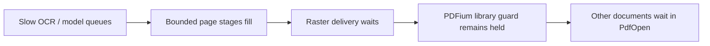

# CUDA corpus performance, 2026-09-14

## Scope and method

All 12 PDFs in `~/Downloads/docs` were parsed in every trial: **368 pages per trial**, ranging from 3 to 144 pages. The concurrency matrix contains six full-corpus trials (two each at 1, 2, and 4 documents in flight). A seventh full-corpus diagnostic trial separates OCR runtime calls from output processing. Total measured work: **84 document executions / 2,576 pages**, excluding warmup.

The existing idle HTTP service was gracefully stopped with user approval to release its approximately 5.5 GiB GPU allocation. It was restored with its original arguments and service environment after testing; its original readiness endpoint returned `ready`. No parser configuration values were changed.

Each concurrency case starts a fresh process, loads one shared parser and model set, and performs two warmup rounds. OCR recognition and TSR sessions are explicitly exercised in addition to a table PDF, so on-demand stages cannot silently miss warmup. Both measured repetitions then use those warmed sessions. Input files were already cached by the OS; these are warm-cache measurements.

The primary matrix uses one unchanged release CUDA executable. The diagnostic run was rebuilt after adding `OcrReadback`; its wall time is reported separately, not substituted into the concurrency comparison. Benchmark logs use `warn,ort=error` to limit tracing noise. The restored service retains the original `info,ort=info,sqlx=warn` configuration.

Wall time includes parsing and compact configured JSON serialization, buffered temporary-file writes, and `fsync` on the report filesystem. Temporary result files are removed afterward. Model loading/warmup, HTTP upload/download, database work, and server-side submission queues are excluded. Model stages use the same `DocParser` and shared engines as the HTTP worker.

## Hardware and configuration

- CPU: Intel Core i9-14900HX, 24 cores / 32 logical CPUs; RAM: 62.6 GiB.
- GPU: RTX 4060 Laptop, 8,188 MiB; driver 615.71.09. Desktop GPU activity remains included in NVML samples.
- Backend: CUDA for layout, OCR, and TSR; all five pinned model artifacts passed SHA-256 verification.
- `tsr.mode = "fallback"`; `ocr.policy = "missing_regions"`; orientation classification enabled.
- Layout session pool: 1; OCR max in flight: 2; TSR max in flight: 2.
- Page concurrency: 4; render queue capacity: 2; blocking task limit: 4; render DPI: 144; longest image edge: 2400.
- Output: evidence included, diagnostics excluded. Database credentials are omitted from artifacts.

## Concurrency comparison

Every row below covers the same complete 368-page corpus. Individual execution times include waiting inside the parser, but exclude time before a document is admitted to the benchmark concurrency window.

| Documents in flight | Trial 1 (s) | Trial 2 (s) | Median batch wall (s) | Pages/s | Mean individual execution (s) | Mean GPU busy | Peak GPU MiB | Peak process RSS MiB |
| ---: | ---: | ---: | ---: | ---: | ---: | ---: | ---: | ---: |
| 1 | 146.76 | 152.44 | 149.60 | 2.460 | 12.47 | 49.0% | 6911 | 4185 |
| 2 | 146.36 | 146.57 | 146.47 | 2.513 | 24.00 | 47.6% | 6657 | 4229 |
| 4 | 148.46 | 149.87 | 149.16 | 2.467 | 47.81 | 47.4% | 6943 | 4370 |

Concurrency 2 reduces median batch time by about **2.1%** relative to concurrency 1. This is smaller than the 5.69-second spread between the two serial trials; two repetitions do not establish a reliable small speedup. Concurrency 4 provides essentially no batch-throughput improvement while increasing average individual execution time to approximately **47.81 seconds**, versus **12.47 seconds** at concurrency 1.

All six trials have zero failed documents, zero page errors, and zero model-unavailable/runtime-failure/timeout degradation warnings. Per-document page counts, OCR invocation counts, TSR invocation counts, and warning counts are identical across all six trials. This is a workload-consistency check, not a full output-accuracy evaluation.

## Per-document execution time

Times are the median of two executions at each concurrency. OCR and TSR counts are per corpus execution, not doubled for repeats.

| PDF | Pages | OCR pages | OCR lines | TSR calls | c1 (s) | c2 (s) | c4 (s) |
| --- | ---: | ---: | ---: | ---: | ---: | ---: | ---: |
| `2303.18223v16.pdf` | 144 | 16 | 717 | 5 | 25.52 | 33.39 | 26.55 |
| `2403.01632v4.pdf` | 47 | 13 | 417 | 0 | 15.17 | 33.14 | 60.75 |
| `2410.05779v3.pdf` | 16 | 5 | 291 | 0 | 11.12 | 33.65 | 64.81 |
| `2412.05210v1.pdf` | 12 | 6 | 439 | 0 | 10.90 | 20.59 | 53.27 |
| `2603.01919v2.pdf` | 23 | 10 | 1101 | 3 | 16.18 | 25.79 | 57.60 |
| `2604.18583v1.pdf` | 15 | 8 | 100 | 0 | 3.82 | 15.55 | 38.53 |
| `2604.18584v1.pdf` | 32 | 13 | 882 | 2 | 26.47 | 32.67 | 52.74 |
| `2604.21959v1.pdf` | 3 | 2 | 87 | 0 | 2.16 | 23.43 | 40.97 |
| `2606.17056v1.pdf` | 25 | 15 | 831 | 0 | 13.20 | 20.63 | 46.28 |
| `2609.04180v1.pdf` | 23 | 9 | 755 | 0 | 13.04 | 26.64 | 59.99 |
| `2609.04184v1.pdf` | 8 | 5 | 239 | 1 | 5.58 | 15.09 | 38.73 |
| `2609.04203v1.pdf` | 20 | 9 | 287 | 1 | 6.42 | 7.48 | 33.56 |

## Confirmed stalls

### 1. Document-scoped PDFium locking limits cross-document overlap

[`Library`](../../crates/pdfium/src/library.rs) retains a process-wide mutex guard for its lifetime. Each [`PDFium worker`](../../crates/core/src/runtime/pdfium_executor.rs) owns that library while serving one document. The [render producer](../../crates/core/src/runtime/pipeline.rs) releases it only after the final raster is delivered. Bounded queues can therefore extend lock ownership while downstream inference is still applying backpressure. Another document waits in `PdfOpen` before it can scan or render.

| Documents in flight | Mean cumulative PdfOpen (s/batch) | Longest single PdfOpen (s) | Mean cumulative OCR queue wait (s/batch) |
| ---: | ---: | ---: | ---: |
| 1 | 0.008 | 0.001 | 266.62 |
| 2 | 45.539 | 23.040 | 528.89 |
| 4 | 239.870 | 47.332 | 821.11 |

The worst opening interval was **47.33 seconds** at concurrency 4; serial opening intervals were around a millisecond. The opening stage includes waiting for the library guard, so this is not evidence of slow disk access.



### 2. OCR runtime calls and queues dominate enrichment

The extra diagnostic corpus completed in **149.48 seconds**, without model degradation. It exercised OCR on **111 pages**, including **6,146 line recognitions** and **6,146 orientation classifications**; fallback TSR executed **12 times**. OCR is enabled on demand, not forced onto every native-text page.

| Stage | Calls | Cumulative interval (s) | Longest interval (s) |
| --- | ---: | ---: | ---: |
| `OcrRecognitionInference` | 6146 | 112.690 | 0.481 |
| `OcrOrientationInference` | 6146 | 18.964 | 0.182 |
| `OcrDetectionInference` | 111 | 18.954 | 0.589 |
| `OcrReadback` | 12403 | 13.715 | 0.016 |
| `OcrDecode` | 6146 | 0.023 | 0.000 |
| `OcrQueue` | 12514 | 269.656 | 5.886 |
| `LayoutInference` | 368 | 35.229 | 0.309 |
| `TsrInference` | 12 | 2.686 | 0.711 |

The [OCR engine](../../crates/ocr/src/engine.rs) awaits orientation and recognition for each selected line in sequence. Each model has one serialized [session worker](../../crates/ocr/src/wasm_compat.rs). More documents therefore mostly add queueing instead of increasing recognition capacity. The longest complete OCR-page interval was **17.05 seconds**, including waits; this can look like stalled page progress.

`OcrReadback` separates output access and CPU probability validation/argmax from the runtime call. Its **13.72 seconds** are materially smaller than recognition runtime (**112.69 seconds**); CPU argmax alone does not explain the bottleneck. Native runtime timing can still include CPU operators, synchronization, and host transfers. These values are not GPU-kernel timings.

All stage totals are accumulated wall intervals. Nested stages and concurrently executing model stages overlap; **do not sum the table into batch wall time**. `OcrQueue` combines the page-admission semaphore and individual OCR session queues.

### 3. JSON persistence and TSR are not primary bottlenecks for this corpus

The configured JSON totals **251,574,317 bytes** (239.9 MiB) per corpus. Median cumulative serialization plus file sync is **0.684 seconds**. TSR inference totals **2.686 seconds** in the diagnostic run. Optimizing either is unlikely to materially change this corpus's approximately 149-second wall time.

## Practical next steps

1. Keep document concurrency at **1–2** on this configuration; do not increase it to 4 expecting more throughput. The original service concurrency was restored, not silently retuned.
2. Address PDFium lock ownership before adding more parsing workers. A shared PDFium actor that safely interleaves multiple documents is a candidate design; simply removing the lock would violate the wrapper's safety contract.
3. Investigate OCR line microbatching and runtime/transfer overhead. The current input/output adapter is single-batch and must be adapted before batching. Additional sessions also need VRAM validation on this 8 GiB GPU.
4. Keep `fallback` TSR and `missing_regions` OCR for this result comparison. Changing recognition coverage or skipping orientation would be a separate accuracy/performance experiment.
5. The original `ort=info` configuration emits thousands of startup messages. Consider `ort=warn` for routine deployment; the overhead of that verbose INFO configuration was not measured.

## Warnings and limitations

- Two distinct documents (`2603.01919v2.pdf` and `2604.18584v1.pdf`) each retained one `TableTextAssignmentFailed` and one `TableStructureUnavailable` warning. Model execution succeeded, but table text binding still has an existing geometry issue; timings are not an accuracy guarantee.
- Other existing warnings include content-layout overlap, empty model regions, and rejected partially overlapping OCR text. Their counts were stable across the six matrix trials.
- GPU/process telemetry is sampled every second. GPU busy/memory includes desktop activity, and RSS peaks are sampled. Mean CPU usage was approximately 130–138%, where 100% represents one logical CPU.
- Clocks, power, and CPU affinity were not pinned. Two repetitions support the lack of a large concurrency benefit, not a statistically strong claim about a 2% difference.
- No `perf` or CUDA kernel trace was collected; bottleneck attribution combines stage measurements with code inspection.

## Artifacts and reproduction

- [Summary CSV](2026-09-14-cuda-corpus/summary.csv) and [JSON](2026-09-14-cuda-corpus/summary.json)
- [Per-document CSV](2026-09-14-cuda-corpus/documents.csv)
- [All baseline stage rows](2026-09-14-cuda-corpus/stages.csv)
- [Input checksums](2026-09-14-cuda-corpus/inputs.json), [parser configuration](2026-09-14-cuda-corpus/parser-config.json), [hardware](2026-09-14-cuda-corpus/hardware.json)
- Raw `c1/c2/c4.metrics.jsonl`, `.gpu.csv`, and `.process.csv` files are beside those summaries. Runner-generated `.stderr.log` files remain local under the repository's log ignore rule.
- [Separated OCR timing totals](2026-09-14-cuda-readback/stages.json) and the raw diagnostic files are in the readback directory.

```sh
rtk cargo build -p docparse-server --release --features cuda
rtk cargo build -p docparse-core --example benchmark --release --features layout-cuda,ocr-cuda,tsr-cuda
rtk uv run --locked --group dev scripts/benchmark.py \
  --pdf-dir ~/Downloads/docs --output-dir /tmp/docparse-cuda-benchmark \
  --concurrency 1 2 4 --repeats 2
```

The output directory must be new. Stop other model instances before reproducing the run. The benchmark tool refuses to label failed/degraded cases as successful. Instrumentation changes add concurrency/repetition controls and OCR readback timing; no parser algorithm optimization was applied.
