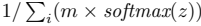
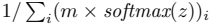

# Missing softmax component subscript

## Reproduction and cause

The bottom-left normalization formula on page 4 of `2403.01632v4.pdf` lost its
final component index before recognition. The production native layout detector
ended the box at x=277.5 pt, while the native `i` occupied x=278.681..281.498 pt.
The 144-DPI crop consequently omitted the entire character. The real Plus-S
recognizer returned the sum index but not the final component index.

Before: 

After: 

## Repair

The core pipeline now completes the inference crop from exact native source
slices and unambiguous adjacent scripts. It reuses the line assembler's existing
font-size, baseline, distance and competing-parent rules. Mixed source runs are
split at their measured byte ranges before scoring; ordinary neighboring prose
and estimated typography are not recruited as scripts. Parent relationships are
computed before expansion, avoiding iterative recruitment of unrelated rows.

The original layout `bbox` remains unchanged. Optional `crop_bbox` records the
actual refined recognition bounds, and source spans include the recovered script
so paragraph rendering does not leave a duplicate native `i` behind. Canonical
text, lines and text items remain unchanged. This is native-text-aware repair,
not a guarantee for scans without reliable text/style geometry or completely
missed formula detections.

## Validation

- A real-model release regression failed before the repair and passed afterward.
- The corrected formula ends in `softmax(z))_{i}`; both index occurrences survive.
- Of the page's 30 native formula outputs, only this target output changed.
- Original block text, lines and text items were byte-for-byte equivalent.
- The real release WebGPU SDK parsed the complete 47-page PDF, produced 584
  formula results with no formula/page failures, and passed the targeted crop,
  LaTeX and source-span assertions. GPU execution was observed by the existing
  inference instrumentation. This does not measure semantic accuracy of all formulas.
- The focused geometry regression also rejects ordinary neighboring text and
  estimated typography. Full Rust tests: 428 passed, 34 ignored. Pre-commit and
  native/WASM strict Clippy passed.

Reproduce the native case:

```sh
rtk proxy env FORMULA_CROP_PDF=/absolute/path/to/2403.01632v4.pdf \
  FORMULA_CROP_OUTPUT=/absolute/path/to/capture \
  cargo test --release --locked -p docparse-core --features layout-coreml \
  --test formula_crop -- --ignored --nocapture
```

After building the production WASM SDK:

```sh
rtk proxy node crates/web/tests/formula.mjs /absolute/path/to/2403.01632v4.pdf \
  target/softmax-webgpu.json webgpu softmax
```

Refresh the browser and reparse existing documents to use the new crop policy;
persisted results are not rewritten. No commit was created.
