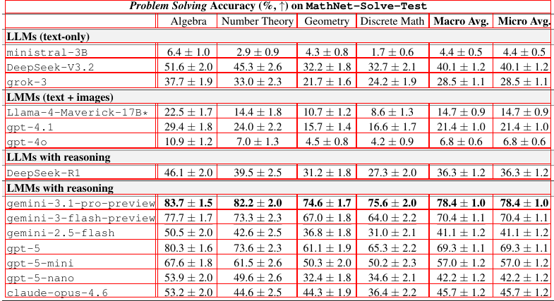

# TATR ONNX feasibility check

Microsoft `table-transformer-structure-recognition-v1.1-all` exported successfully to ONNX opset 17. This is an isolated Python experiment; production models and Rust inference are unchanged.

## Results

One real repository fixture (`crates/tsr/tests/fixtures/table.png`, 785 × 427 pixels), FP32, batch 1, ORT 1.29.0, optimization All, memory pattern disabled, four CPU threads, three warmups and twenty measured synchronous calls. CUDA uses the local RTX 4060 Laptop GPU (8 GB), with TF32 disabled for strict numerical parity. Calls include input/output device copies; preprocessing, structure recovery and service scheduling are excluded.

| Provider | TATR median / p95 | SLANet+ median / p95 | SLANet+ / TATR median |
| --- | --- | --- | --- |
| CUDA | 9.69 / 9.75 ms | 57.65 / 65.77 ms | 5.95× |
| CPU | 79.51 / 83.34 ms | 37.44 / 38.53 ms | 0.47× |

TATR is faster on this GPU fixture, but slower on CPU. These measurements cannot predict production throughput or compare directly with the loaded remote server. SLANet+ uses its existing 488 × 488 reference tensor; TATR uses its checkpoint's longest-edge-800 RGB preprocessing (435 × 800 here). This is a pipeline-candidate comparison with each model's intended input, not identical computational workloads. No separate cell detector is included in either timing.

CUDA profiling confirmed execution on CUDA (3,056 node events across verification calls); CPU nodes also execute shape/index operations. Profiling ends before timed TATR calls and is disabled for timed SLANet+ calls. Default TF32 initially exceeded the strict output tolerance, so both benchmark sessions explicitly disable it.

ONNX checker and PyTorch/ORT FP32 comparisons passed at `[1,3,435,800]`, `[1,3,348,640]` and a padded mixed-aspect batch `[2,3,800,800]`. Tolerance is `rtol=1e-3, atol=1e-3`. Maximum CUDA absolute errors were 0.0000501 for logits and 0.0000119 for normalized boxes; CPU maxima were 0.000107 and 0.0000201. Batch 2 verifies export correctness, not batch throughput. Legacy-export tracer warnings remain; the tested dynamic shapes passed, not every possible input shape.

## Structure recovery

Pinned upstream Microsoft postprocessing, confidence threshold 0.5, no OCR tokens: **20 rows, 7 columns, 110 cells**. Every cell's row/column span matches the existing SLANet regression oracle, including merged section headings. The overlay was visually inspected. The single measured Python postprocessing call took 9.49 ms in the CUDA run and 10.12 ms in the CPU run; these are not warmed latency distributions.



This fixture is not an independently annotated evaluation corpus. Matching its oracle does not establish general accuracy, header semantics, text assignment accuracy, or robustness on the user's previously failing LORE examples. This initial Python feasibility check predates the Rust adapter; see the TSR crate README for its current integration and validation.

## Reproduce

From the repository root, use an isolated environment:

```sh
rtk proxy uv venv --python 3.12 /tmp/docparse-tatr-env
rtk proxy uv pip install --python /tmp/docparse-tatr-env/bin/python torch==2.9.1 torchvision==0.24.1 --index-url https://download.pytorch.org/whl/cpu
rtk proxy uv pip install --python /tmp/docparse-tatr-env/bin/python transformers==4.57.6 onnx==1.20.1 onnxruntime-gpu==1.29.0 pymupdf==1.28.2
```

Download the pinned model/config and unmodified upstream postprocessing into the ignored artifact directory:

```sh
rtk proxy /tmp/docparse-tatr-env/bin/python - <<'PYTHON'
from pathlib import Path
from urllib.request import urlretrieve
path = Path("models/tatr-v1.1-all")
path.mkdir(parents=True, exist_ok=True)
model_revision = "7587a7ef111d9dcbf8ac695f1376ab7014340a0c"
source_revision = "16d124f616109746b7785f03085100f1f6247575"
for name in ["model.safetensors", "config.json", "preprocessor_config.json"]:
    urlretrieve(f"https://huggingface.co/microsoft/table-transformer-structure-recognition-v1.1-all/resolve/{model_revision}/{name}", path / name)
for source, target in [("src/postprocess.py", "postprocess.py"), ("LICENSE", "LICENSE")]:
    urlretrieve(f"https://raw.githubusercontent.com/microsoft/table-transformer/{source_revision}/{source}", path / target)
PYTHON
rtk proxy /tmp/docparse-tatr-env/bin/python crates/tsr/tests/python/tatr_onnx.py --provider cuda
rtk proxy /tmp/docparse-tatr-env/bin/python crates/tsr/tests/python/tatr_onnx.py --provider cpu
```

CUDA requires the matching CUDA/cuDNN runtime; this host has CUDA 13 and cuDNN 9. The script asserts provider activation, records CUDA placement, and fails if CUDA falls back entirely to CPU. It requires the existing SLANet model and repository fixture. The current Transformers processor rejects the checkpoint's longest-edge-only size config; the script explicitly resizes with checkpoint bilinear interpolation, then uses its normalization and padding.

Export is cached in `models/tatr-v1.1-all/inference.onnx`; remove that generated file to force a fresh export. Outputs are `logits` `[batch,125,7]` and `pred_boxes` `[batch,125,4]`, with normalized center-format coordinates. Export is approximately 110 MB. Raw timings, parity errors and SHA-256 hashes are in [measurements.json](measurements.json); raw cells and per-provider reports remain in the ignored artifact directory.

Sources: [Microsoft checkpoint](https://huggingface.co/microsoft/table-transformer-structure-recognition-v1.1-all/tree/7587a7ef111d9dcbf8ac695f1376ab7014340a0c), [Microsoft postprocessing](https://github.com/microsoft/table-transformer/blob/16d124f616109746b7785f03085100f1f6247575/src/postprocess.py).
