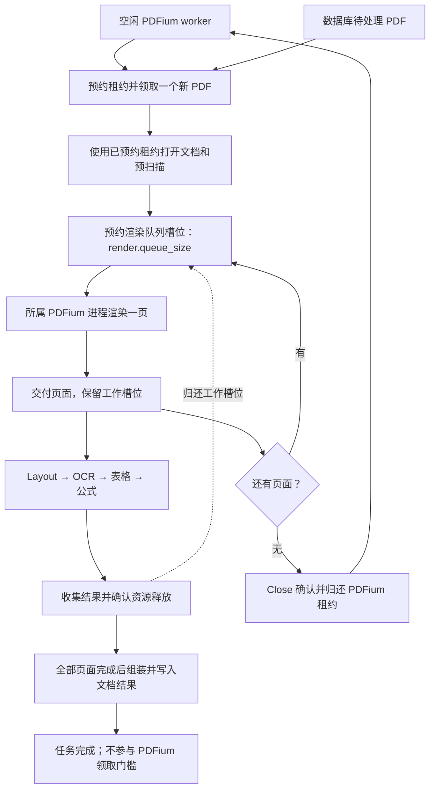

# 文档、页面与模型队列的背压设计

日期：2026-09-18

状态：已实现并验证；验证记录见同日 pipeline-backpressure 实施计划。按最新要求，渲染侧并发和背压集中在 `render.workers`、`render.queue_size`，不引入 `page_limit`。

## 1. 配置与决策

```toml
[render]
workers = 5
queue_size = 16
dpi = 144
max_long_edge_pixels = 2400

[runtime]
continue_on_error = true

[ocr.recognition]
session_size = 2
queue_size = 8
batch_size = 4
```

两个渲染配置均必填：

- `render.workers`：只决定 PDFium 进程池大小。PDFium worker 空闲时就可领取新 PDF，不再按尚未完成的完整文档任务数量限流。
- `render.queue_size`：所有文档共享的、尚未确认完成的页面工作容量。它包含已预约但正在渲染、等待交接、正在处理以及取消后尚未释放资源的页面。

`queue_size = 16` 表示所有 PDF 合计最多 16 个未完成页面，不是每个 PDF 16 页，也不是 16 个等待页面再加额外的活动页面。已渲染但仍在推理的文档可以多于 `render.workers`，它们不继续占用 PDFium worker。

模型已有的 `session_size`、`queue_size`、`batch_size` 保持现有含义。模型队列的 `queue_size` 计待消费输入；渲染队列的 `queue_size` 计尚未完成的页面交付。二者释放槽位的时机不同，必须在配置文档中明确。

示例数值用于说明语义，不是性能测试得出的最优值。

## 2. 当前代码事实与迁移

| 位置 | 当前行为 | 目标行为 |
| --- | --- | --- |
| `crates/server/src/main.rs` | 分别读取 `server.jobs` 和 `server.pdfium_workers` | 用 `render.workers` 设置 `PdfiumPool::start`，移除 `WorkerOptions.concurrency` |
| `crates/server/src/worker.rs` | 达到任务上限后停止领取数据库任务 | 由空闲 PDFium 租约驱动领取，删除按完整任务数判断的准入条件 |
| `crates/server/src/pdfium_pool/mod.rs` | 每个进程同一时刻拥有一个文档租约，命令串行执行 | 保留线程安全与进程隔离边界 |
| `crates/core/src/runtime/pipeline.rs` | 最后一页渲染并交付后关闭 PDFium 文档 | 保留提前归还进程租约 |
| 同上 | 四个阶段各受 `stage_pages` 限制，另有每文档渲染缓冲 | 改为跨文档共享的页面工作容量，整页完成后归还槽位 |
| `crates/core/src/pdfium/executor.rs` | 内部命令通道复用 `render_queue_capacity` | 固定容量 1 的串行协议交接，不另设用户配置 |
| `crates/common/src/runtime.rs` | `run_cpu` 没有读取 `blocking_task_limit` | 删除无效配置 |
| `crates/config/src/wasm_compat.rs` | 三个旧 runtime 字段在 WASM 被强制为 1 | 删除旧限制，改为新的渲染配置契约 |

目标配置不再接受：

- `server.jobs`
- `server.pdfium_workers`
- `runtime.stage_pages`
- `runtime.render_queue_capacity`
- `runtime.blocking_task_limit`

取消上一版提出的 `runtime.page_limit`，不保留同义配置、自动换算或隐藏的独立页面上限。

## 3. 两个数值、不同生命周期

设 `W = render.workers`，`Q = render.queue_size`。

| 资源 | 上限 | 获取 | 释放 |
| --- | --- | --- | --- |
| 活跃 PDFium 子进程 | `W` | 服务初始化进程池；打开文档前取得租约 | 文档 Close 确认后复用；异常进程回收后才能替换 |
| 未完成页面工作 | `Q` | 发起页面渲染之前预约队列槽位 | 页面交付已结束，且实际持有的后台资源释放之后 |
| 单个模型待消费输入 | 该模型的 `queue_size` | 入队 | 消费者取走 |
| 单个模型消费者 | 该模型的 `session_size` | 模型加载 | 引擎关闭 |

文档任务与 PDFium 租约不是同一个生命周期。最后一页交付后关闭 PDFium 并归还租约；进程池出现空闲 worker 就领取下一份 PDF，即使已有 `W` 份或更多旧文档仍在推理、组装或写结果。完整任务集合仅用于监督、续租、超时和收集结果，其长度不参与领取判断。

不存在独立的文档 semaphore、`server.jobs` 替代字段或 `tasks.len() < render.workers` 条件。只有持有 PDFium 的加载/扫描/渲染文档数受 `W` 限制；后续处理交给队列背压。

数据库继续承担持久化等待队列。只有已经预约到空闲 PDFium worker 时才领取一个任务，不提前领取全部任务再创建等待进程的 future。上传配额和数据库队列长度策略不在此次范围内。

### 3.1 任务领取顺序与租约交接

领取循环必须按实际空闲资源推进：

1. 等待并预约一个可用 PDFium worker；同时继续收集旧任务结果、处理服务退出。
2. 调用现有数据库原子领取逻辑，只领取一个 PDF 任务。
3. 没有任务时释放未使用的预约并退避等待；数据库失败也释放预约，不占用页面队列容量。
4. 领取成功后立即建立该任务的续租、超时与取消监督，使用已经预约的 worker 打开文档。
5. 把已经打开的 session 交给 parser；parser 不得再次调用普通 `pool.open()` 获取第二个进程，避免单 worker 下自我等待。
6. 最后一页交付并 Close 确认后，租约重新变为空闲，立即允许领取下一任务；旧任务的推理、组装、结果写入继续独立受监督。

现有 `PdfiumPool::open()` 把等待租约和 Open 合在一起，需要拆出可转移的空闲预约与使用该预约打开文档的入口。core 的文档解析流程需要接收已经打开的 session；已有普通 API 仍可通过 provider 打开后进入相同流程，不复制解析逻辑。

未打开文档的空闲预约与已经打开文档的租约必须区分。前者在无任务、领取失败或取消时可以干净归还；不能直接沿用当前 `Lease::drop()` 的“未知文档状态取消并回收子进程”路径，否则数据库空轮询也会反复重启 PDFium。打开后的异常仍按现有 Close 确认或进程回收规则处理。

不以页面队列是否满作为领取新 PDF 的额外条件。只要有空闲 PDFium worker，就可领取、加载和预扫描；随后在下一次 Render 之前等待页面队列容量。队列满不会绕过背压产生新栅格。

文档监督任务可以多于 `W`。其续租直到原任务真正结束，不能把 PDFium Close 当成数据库任务完成；也不能因它们仍在 `JoinSet` 中就阻止空闲 worker 领取新 PDF。

## 4. 渲染队列采用完成确认语义

普通 `mpsc::channel(Q)` 在 `recv()` 时立即释放缓冲槽位，消费者若不断取出页面并创建任务，仍会绕过背压。

这里的渲染队列采用“预约—交付—完成确认”语义：

1. 已加载文档的渲染生产者异步预约一个槽位。
2. 没有槽位时等待，此时不发起渲染、不分配下一页图像。
3. PDFium 渲染这一页，渲染结果和槽位凭证一同交付。
4. 消费者接收页面并运行完整页面处理链；出队不归还工作槽位。
5. 正常结果被收集、或错误/取消完成实际清理后，归还工作槽位。

这里的确认不负责重试或消息重投，不引入消息代理。它只表示这页的工作容量可以重新使用。



不同页面自然处于不同处理阶段；模型请求仍提交给各自共享队列。模型变慢会使页面迟迟不能完成确认，渲染队列槽位逐渐用尽，最终停止发起新的 Render 操作。

## 5. 最小实现边界

复用 `tokio::sync::Semaphore`、`OwnedSemaphorePermit`、`mpsc` 和现有任务集合，不自建队列调度框架。

队列组件内部以 `Q` 个 permit 实现工作槽位，通过可克隆的 `PageLease` 绑定一页交付的生命周期。它是渲染队列自身的容量计数，不是另一套 `page_limit`：容量只有一个来源 `render.queue_size`，不会与第二个预算叠加。

现有每文档结果通道可以保留为固定容量 1 的内部交接通道。它不再是公开的渲染容量，不再有额外配置；跨文档共享的工作槽位才决定总背压。每个文档仍只有一个顺序渲染生产者，每次只预约下一页一个槽位。

共享范围为同一个服务 parser 及其全部 clone、全部文档。独立创建的 parser 或不同 Web Worker 不自动共享内存；不引入静态全局单例或分布式信号量。服务已有单一共享 parser，直接满足该范围。

服务实例创建 `W` 个 PDFium 进程；任务领取循环消费池提供的空闲租约，不读取另一个任务并发数。core 保持 PDFium provider 注入边界，不自行启动第二套服务子进程池。独立库调用者使用何种 provider 和文档调度入口需遵从相应 API 契约，不能把本地线程 provider 宣称为已创建了 `W` 个隔离进程。

### 5.1 工作槽位必须跟随实际资源

只在页面 future 局部变量中持有 permit 不够。取消 future 不会立即终止已经启动的 `spawn_blocking`、IPC 或原生推理。

要求的所有权链：

- Render 命令提交时，槽位引用进入实际执行方的请求对象。本地 PDFium 命令和服务端 IPC 监督对象都要持有它；permit 不序列化到子进程。
- 渲染结果、页面任务、必要的裁剪和模型请求共享同一页的引用；clone 只增加引用计数，不消耗第二个槽位。
- 脱离页面 future 生命周期的预处理闭包、推理批次及读回操作持有引用直到实际工作结束。
- 正常页面结果被调度器收集后释放调度器的引用；最终文档中的纯 `PageResult` 不继续占槽位。
- 取消或错误通过 RAII 释放各自引用。最后一个实际资源持有者退出后，槽位才真正回到队列。

页面从一个阶段转移到下一个阶段，不申请新槽位，也不提前确认。

资源所有权不能绑定到日志开关、`Timings` 接收器或观测回调。`PageImage::data()` 能克隆裸像素 `Arc`，tensor-only 请求也可能不再持有原图；实现必须审查这些实际所有权边界，不能假定只在图片外层增加一个字段就已覆盖取消路径。

### 5.2 容量不变量

不同页面的以下状态合计不超过 `Q`：

`已预约/正在渲染 + 已交付待处理 + 正在处理 + 完成待收集 + 取消后仍在清理`

同一页的多个引用只计一次。不会出现 `Q + W` 个页面，或每份 PDF 各自 `Q` 页；正在渲染也已经占了队列工作槽位。

不要求 `Q >= W`。当 `W = 5`、`Q = 2` 时，最多五份文档占有 PDFium 租约，所有文档合计最多两页进入渲染及后续处理。已经释放 PDFium 的旧文档可以继续推理，不能据此推导完整未完成任务数也最多为五。

## 6. 页面调度器与资源顺序

移除四个阶段分别计数的 `stage_pages`，使用一个页面 `TaskSet`，每个任务依次执行已有链路：

`prepare → recognize → resolve_tables → finish`

渲染生产者负责预约；页面调度器负责接收、启动任务、收集结果和转发观测。调度器主循环不等待新的队列槽位，否则可能停止收集能够归还槽位的完成结果。

成功页面按完成顺序收集，最终文档按原有页码排序；一个较早的慢页不能阻止较晚页面完成确认。

资源获取顺序为：

`预约空闲 PDFium worker → 领取一个数据库任务 → 打开文档/预扫描 → 渲染队列槽位 → Render → 模型队列`

等待 PDFium 和预扫描期间不占页面工作槽位。下游处理同一页时不能再次预约页面槽位，也不重新请求 PDFium 租约，因此不会形成“全部页面槽位被等待 PDFium 的下游任务占用”的资源环。

每个已加载文档最多发出一个等待槽位的申请，利用 semaphore 的 FIFO 等待顺序防止批量抢占。保证已经等待的请求能前进，不保证每份文档拥有相同页数；不新增每文档配额或轮询调度器。

单页 API 在进入处理链前通过同一渲染队列容量取得凭证。调用方已经分配的输入图像不受渲染前准入控制；直接使用模型 crate 也不自动进入 parser 的页面队列。

## 7. 错误、取消与退出

| 场景 | 行为 |
| --- | --- |
| 模型队列满 | 请求等待，页面继续占渲染工作槽位 |
| 渲染工作槽位耗尽 | 暂停下一次 Render；已交付页面继续运行并完成确认 |
| 内部结果交接通道满 | 生产者等待发送，已经渲染的页面仍占原槽位 |
| 某页公式特别慢 | 保留该页槽位，其他已准入页面继续推进 |
| 等待页面预约时取消 | 取消申请，不占槽位；按既有协议清理文档租约 |
| 已预约空闲进程但未领取到任务 | 干净归还空闲预约并退避，不重启子进程、不产生解析 future |
| 领取任务后 Open 失败 | 按数据库租约记录失败/重试，清理实际进程状态后归还或替换 worker |
| Render/IPC 执行中取消 | 实际执行方持有引用，直到渲染结束或进程回收、IPC 清理确认 |
| 模型执行中超时或取消 | 停止产生新请求，跳过已取消队列项；在途批次实际结束后释放引用 |
| 渲染失败且允许继续 | 在当前槽位中完成原生文本降级，结果收集后归还 |
| 文档致命错误 | 停止生产，排空或销毁交接通道，取消并收集页面任务，清理 PDFium；不关闭其他文档共享的队列容量 |
| 模型消费者退出 | 沿用队列关闭和错误传播，进入页面失败/降级路径 |
| 服务停止 | 停止领取任务，排空或取消既有任务，再关闭共享资源；唤醒等待者返回明确错误 |

不能只关闭接收器却保留其中的页面。缓冲项中的槽位凭证必须随排空或 receiver 销毁释放；发送 abort 本身不代表资源已回收。

原生调用若一直不能退出，继续占用其槽位并报告问题，不能强行增加可用容量。PDFium 以确认子进程退出为回收依据；进程内无法安全终止的模型线程需要服务级恢复，不承诺超时能立即打断所有原生操作。

## 8. 配置迁移与校验

- `server.pdfium_workers` 迁移到 `render.workers`；删除 `server.jobs` 及对应的完整任务数门槛，不将其隐藏为内部的同值限制。
- `render.queue_size` 取代旧阶段上限与渲染缓冲调参；不引入 `runtime.page_limit`。
- 旧 `render_queue_capacity = 2` 只限制等待缓冲；新的 `render.queue_size = 2` 限制全部未完成页面，不能把这次变更描述成纯重命名。
- 删除旧字段并明确拒绝，不静默忽略，不保留互相覆盖的别名。
- 删除 `--jobs`，提供只覆盖进程池大小的 `--render-workers`；文件、profile、环境和 CLI 只覆盖同一个最终值。
- 环境变量使用 `DOCPARSE_RENDER__WORKERS`、`DOCPARSE_RENDER__QUEUE_SIZE`。
- `render.workers` 沿用 PDFium 池的正整数和运行时容量上界校验，不沿用已删除文档任务配置的 `128` 上限；`render.queue_size` 使用已有队列的可移植正整数范围 `1..=536869887`。允许 `queue_size < workers`。
- 两个字段在配置层合并后必填。加载器剔除代码默认来源中的这两个字段，避免自动补齐掩盖漏配；程序化 preset 可以显式提供完整值。

模型队列配置保持不变。内部 PDFium 命令、IPC 交接和 session 命令通道继续使用固定小容量，不为串行协议交接再增加调参项。

## 9. 原生与 WASM

原生服务用 `render.workers` 初始化 PDFium 进程池，以空闲租约驱动文档领取；用共享 parser 的 `render.queue_size` 控制所有文档的页面交付。

WASM 没有原生 PDFium 子进程池。当前 SDK 一个 Worker 同时解析一个文档，因此本版明确要求 `render.workers = 1`；更大值报错，不宣称配置了就会创建多个浏览器 Worker。多 Worker 文档调度不纳入本次变更。

WASM 的 `render.queue_size` 可以大于 1，同一文档多页通过异步槽位预约推进；删除旧三个 runtime 字段必须为 1 的限制。

ORT Web 全局推理/读回保护继续保留。页面准备、排队与后处理可以重叠，增加页面队列容量不意味着 GPU 模型调用一定并行。

SDK 类型、初始化校验、默认完整 preset 和示例统一新配置。验收包含真实浏览器模型下的多页、取消和恢复，不以原生测试或 WASM 编译成功代替。

## 10. 内存保证的边界

渲染队列保证未完成页面数不超过 `Q`，不承诺固定 RSS、显存或所有 tensor 的字节上限。

原始 RGB 栅格粗略估算为 `Q × 宽 × 高 × 3` 字节。模型权重、PDFium 中间缓冲、IPC 拷贝、预扫描文本、最终文档结果和裁剪/tensor 另计。`render.workers` 只约束仍占用 PDFium 的文档，不约束已释放 PDFium 的文档结果或输出阶段。结果需要及时收集和落盘；这两个渲染参数不提供完整文档输出积压的字节上限，不能据此宣称整个服务内存严格有界，也不能用新增完整任务门槛偷偷补上这一边界。

现有 OCR/公式裁剪窗口继续按模型消费者批容量和 `queue_size` 推导；表格保持就绪请求全部提交，不恢复 `table_jobs`。单页大量区域仍可能持有较多等待入队的裁剪和 tensor，页面队列容量不等于这些数据的字节预算。

如实测需要进一步约束该部分内存，应单独把重预处理移到有界模型准入之后，或改成轻量请求入队、消费者预处理。本设计不新增第二个可配置页面上限，也不把尚未实现的模型预处理优化算入内存保证。

## 11. 验收场景

1. `render.workers = 2`：同时持有 PDFium 租约的文档和活跃子进程均不超过两个；即使完整未完成任务数已达到两个，空闲进程仍会触发新任务领取。
2. 两个文档共享 `render.queue_size = 2`：第三页不能开始渲染，直到已有页面完成确认并实际释放资源。
3. 取出渲染结果、完成 Layout 或完成 OCR 都不会单独归还工作槽位。
4. `workers = 5`、`queue_size = 1`、模型 `batch_size > 1` 时无死锁，短批次及时运行。
5. `workers = 1`、`queue_size = 1`：PDF A 的最后一页交付并 Close，A 的模型处理故意阻塞。此时 PDF B 必须能够领取并打开，但不能渲染，直到 A 的页面归还队列槽位；不得等待 A 的完整任务结束才领取 B。
6. 一个页面在最后阶段延迟时，其他已交付页面继续运行，完成结果不受页码顺序阻塞。
7. 多文档已排队的槽位申请不会被同一生产者后续申请无限超越。
8. 在等待预约、交接阻塞、预处理、模型排队、推理和结果收集时分别取消，实际清理后容量恢复，其他文档继续工作。
9. 可控真实阻塞操作尚未结束时取消页面 future，槽位不能提前复用；操作结束后恢复。
10. PDFium 崩溃、模型消费者退出、文档超时与服务停止均不泄漏槽位或复用未清理的进程租约。
11. 缺失、零值、非法类型、超界值和旧字段均被拒绝；profile/环境/CLI 覆盖保持同一数值来源。
12. 原生真实 PDF 与真实模型结果保持一致；WASM 在 `workers = 1`、`queue_size > 1` 下验证多页、取消及重新创建 parser。
13. 单页与文档 API 共享页面交付容量；直接模型调用和调用方已持有图像的内存边界按文档说明验证。
14. 空任务队列轮询、数据库领取失败和领取期间取消均干净归还未使用的预约，不重启 PDFium、不泄漏租约；已预约 worker 不会在 parser 内被第二次申请。
15. PDFium 已归还而旧任务仍在推理时，旧任务的数据库续租、超时和结果发布保持有效；服务退出能同时收集加载中和已释放 PDFium 的旧任务。

测试位于 crate 级 `tests/` 或精确的 `#[cfg(test)] mod tests`，不在生产结构中加入测试专用字段。WebUI 验收使用生产 app 后端及其配置的 provider。

## 12. 实施落点与范围

| 模块 | 拟议变更 |
| --- | --- |
| `crates/config`、`docparse.toml`、SDK 类型与示例 | 集中 render 配置，校验和旧字段迁移 |
| `crates/server/src/main.rs`、任务领取循环 | 删除完整任务并发门槛，由空闲 PDFium 租约驱动领取，CLI 同步 |
| `crates/common` | 最小页面交付槽位所有权类型，复用现有同步原语 |
| `crates/core/src/parser.rs` | 初始化共享渲染工作容量，clone 共享，单页入口接入 |
| `crates/core/src/runtime/pipeline.rs`、`stages.rs` | 渲染前预约、整页任务、完成确认与取消清理 |
| 本地 PDFium 执行器与服务进程池 | 分离空闲预约与已打开文档租约；Render/IPC 持有页面引用，保持进程隔离与提前 Close |
| 页面图像、裁剪、模型请求及阻塞任务边界 | 明确传播资源引用，避免取消提前释放容量 |
| 现有测试与 README | 覆盖不变量，统一配置解释 |

实现已落地，未创建 commit，未使用 subagent 或 worktree。
